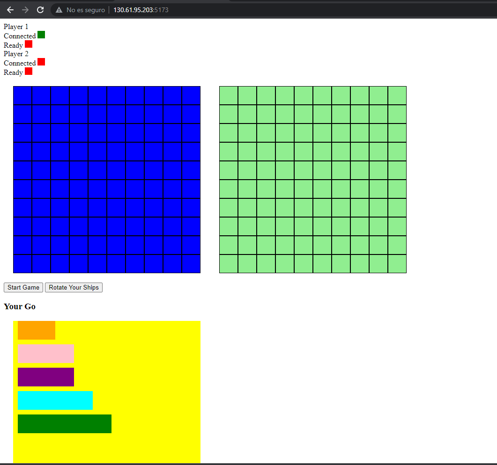

El proyecto consistirá en una réplica del popular juego hundir la flota.

Las reglas son las siguientes:

1. Cada jugador comienza colocando sus barcos en su tablero. Los barcos se colocan horizontal o verticalmente y no pueden solaparse.

2. El tamaño y la cantidad de barcos dependen de la variante del juego, pero generalmente incluyen barcos de diferentes tamaños, como un portaaviones, un acorazado, un submarino, un destructor y un barco patrulla.

3. Una vez que los barcos están colocados, los jugadores se turnan para realizar disparos en el tablero del oponente. Cada jugador indica un disparo marcando una casilla en el tablero del oponente con una ficha.

4. Si un disparo alcanza un barco, el jugador anuncia "¡tocado!" y marca la casilla correspondiente del barco en su tablero con otra ficha. El oponente debe indicar si el barco está hundido (si todas las casillas del barco han sido marcadas) o si solo ha sido tocado.

5. El juego continúa hasta que un jugador hunda todos los barcos del oponente. El primer jugador en hundir todos los barcos del oponente gana el juego.

6. Es importante recordar que los jugadores no pueden mover sus barcos una vez que se han colocado y que no pueden realizar disparos en casillas que ya han sido marcadas.

Basicamente como se ha explicado el juego es por turnos, cada jugador tiene un tablero donde coloca sus barcos y otro donde dispara. El objetivo es hundir todos los barcos del oponente.

## Requisitos
Para jugar al juego tendremos que instalar todas las dependencias tanto del backend como del frontend.

### Backend
Para instalar las dependencias del backend tendremos que ejecutar el siguiente comando en la carpeta del backend:
Para instalar las dependecias de python del fichero setup.py:
```
pip install -r requirements.txt
```
Después de esto ejecturamos el servidor con el siguiente comando:
```
python server.py
```

### Frontend
Para instalar las dependencias del frontend tendremos que ejecutar el siguiente comando en la carpeta del frontend:
```
npm install
```
Después de esto ejecturamos el servidor con el siguiente comando:
```
npm run start:dev
```

Iremos al navegador con el puerto 5173 para que se nos muestre el juego. Para jugar necesitamos dos jugadores, por lo que tendremos que abrir otra pestaña en el navegador con el mismo puerto.

### Funcionamiento

Se tiene que poner todos los barcos en ambos jugadores para que se pueda dar a start y empezar a jugar. Una vez se ha dado a start, el jugador que empieza es el que ha creado la partida. El juego consiste en ir disparando a los barcos del oponente hasta que se hundan todos. Cuando se hunden todos los barcos de un jugador, el juego termina y se muestra un mensaje de ganador.

Puedes mirar que jugador eres en la parte superior de la pantalla, si eres el jugador 1 o el jugador 2. Saldrá en negrita el jugador que eres.
Los barcos tienen los distintos colores para que se puedan diferenciar entre ellos.

Destroyer : Naranja

Submarine : Rosa

Cruiser : Morado

Battleship : Azul

Carrier : Verde

Cuando se entre en la partida tendrás los barcos abajo puedes arrastrarlos y soltarlos en la casilla de la izquierda que es la tu tablero. Una vez que los tengas todos colocados, le das a start y empieza el juego.

El tablero de la derecha es el tablero del oponente, donde se irán marcando los disparos que se vayan haciendo. Para hacer un disparo simplemente tienes que hacer click en la casilla que quieras disparar. 

Si todo ha ido bien cambiará de turno y el otro jugador podrá hacer su disparo. Si ha ido mal puede ser por distintas razones como que no sea tu turno, que ya hayas disparado a esa casilla , que no hayas puesto todos los barcos o que no todos los jugadores hayan entrado en la partida.


