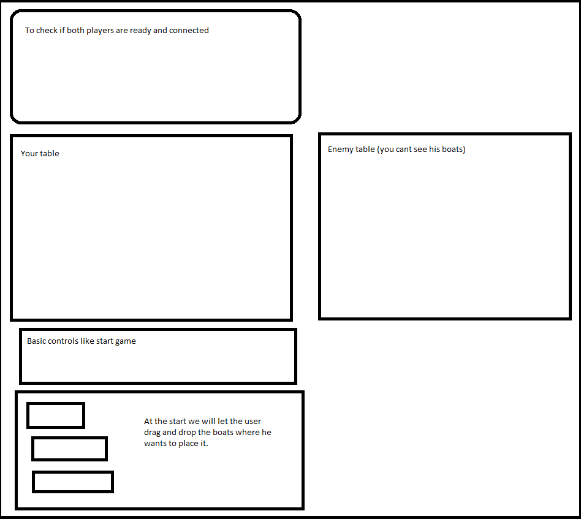

En mi simulación de hundir la flota, el frontend se ocupará de que ul usuario ponga los barcos en el lugar que quiera siguiendo las reglas mencionadas en el README principal.
Una vez hecho esto tendremos que pintar el tablero y mandarle al servidor un objeto con el estado de la partida ya que vamos a hacerlo multijugador a tiempo real con la libreria de socketio.
Una vez que entremos al juego puede tener una forma parecida a esta. (Puede cambiar en versiones posteriores del juego)
